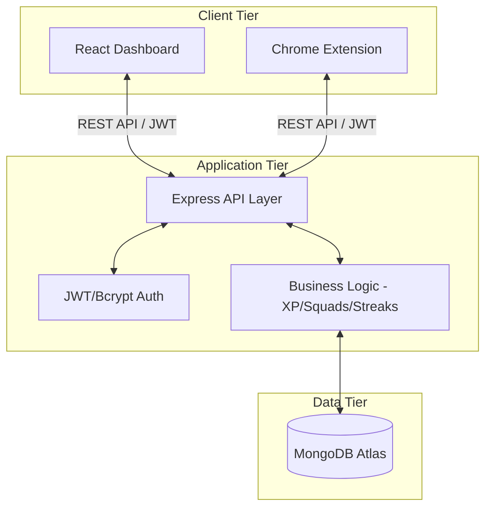

# 🏗️ FocusForge Full-Stack Architecture

This document provides a comprehensive overview of the FocusForge ecosystem, encompassing the Frontend Dashboard, the Backend API, and the Chrome Extension.

## 1. High-Level System Architecture

FocusForge is a distributed system designed for gamified productivity. It consists of three primary layers communicating over a centralized REST API.

---

## 2. Frontend Architecture (Dashboard)

The frontend is a modern React application built with Vite and styled using a custom Neo-Brutalist design system.

### Core Technologies
- **Framework**: React 18 (TypeScript)
- **Build Tool**: Vite
- **Styling**: Tailwind CSS + Custom Neo-Brutalist Layer
- **State Management**: React Context (`AppContext.tsx`)
- **Icons**: Lucide React
- **Charts**: Recharts (Customized for high-contrast/Neo-brutalist)

### Directory Structure
- `src/AppContext.tsx`: Centralized state for User profile, XP, and global dashboard metrics.
- `src/components/`: Modular UI components (Sidebar, StatsRow, DopamineChart, RewardsStore, etc.).
- `src/index.css`: Defines the global design tokens (Mustard Yellow, Lavender, Mint, etc.) and brutalist component classes.

---

## 3. Backend Architecture (API)

A stateless Node.js/Express server that manages the source of truth for all user data and social interactions.

### Core Modules
- **Identity Service**: Handles registration and JWT-based authentication.
- **XP Engine**: Calculates experience points based on focus sessions (1 XP/min).
- **Squad Engine**: Manages social groups and real-time "live" status tracking.
- **Interception Service**: Logs and manages blocked domain attempts captured by the extension.

### Data Model (Mongoose)
- **User**: Identity, total focus minutes, level, and current streak.
- **FocusSession**: Start/End timestamps and XP yield.
- **Squad**: Member lists and group rankings.
- **Blocklist**: User-specific domains for the extension to intercept.

---

## 4. Extension Architecture (Focus Guard)

A Manifest V3 Chrome Extension that acts as the primary data collector and enforcer.

### Components
- **Background Service Worker**: Monitors browser events and handles domain blocking.
- **Content Scripts**: Injects UI overlays on blocked sites.
- **Sidepanel/Popup**: Provides a mini-view of focus stats and session controls.
- **API Bridge**: Communicates with the Backend using the same JWT credentials as the Dashboard.

---

## 5. Data Flow & Communication

### Authentication Flow
1. User logs in/signs up on the **Dashboard** or **Extension**.
2. **Backend** verifies credentials and issues a **JWT**.
3. The **JWT** is stored locally and included in the `Authorization` header for all subsequent requests.

### Focus Session Lifecycle
1. User starts a session in the **Extension**.
2. Extension notifies **Backend**; Backend creates a `FocusSession` record.
3. During the session, the **Extension** enforces the blocklist.
4. On completion, **Backend** calculates XP, updates the **User** streak, and notifies the **Dashboard** (via polling or refresh).

---

## 6. Design System (Neo-Brutalism)

The project utilizes a strict "Neo-Brutalist" visual language:
- **Borders**: `2px solid #111827`
- **Shadows**: `4px 4px 0px #111827` (No blur)
- **Colors**: High-contrast vibrant palette (Yellow #FCD34D, Purple #A78BFA, Green #6EE7B7).
- **Typography**: Heavy weight (800-900) sans-serif (Poppins).

---
*Last Updated: May 2026*
